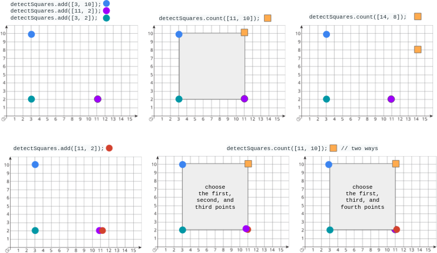

+++
title = "LeetCode - 150 - Detect Squares"
date = 2026-06-23T08:04:51+03:00
tags = ["LeetCode", "150", "Detect Squares", "Math_&_Geometry", "Swift"]
draft = false
+++

### The problem

You are given a stream of points on the X-Y plane. Design an algorithm that:

* **Adds** new points from the stream into a data structure. **Duplicate** points are allowed and should be treated as different points.
* Given a query point, **counts** the number of ways to choose three points from the data structure such that the three points and the query point form an **axis-aligned square** with **positive area**.

An **axis-aligned square** is a square whose edges are all the same length and are either parallel or perpendicular to the x-axis and y-axis.

Implement the `DetectSquares` class:

* `DetectSquares()` Initializes the object with an empty data structure.

* `void add(int[] point)` Adds a new point `point = [x, y]` to the data structure.

* `int count(int[] point)` Counts the number of ways to form **axis-aligned squares** with point `point = [x, y]` as described above.

**Example 1:**



```
Input
["DetectSquares", "add", "add", "add", "count", "count", "add", "count"]
[[], [[3, 10]], [[11, 2]], [[3, 2]], [[11, 10]], [[14, 8]], [[11, 2]], [[11, 10]]]
Output
[null, null, null, null, 1, 0, null, 2]

Explanation
DetectSquares detectSquares = new DetectSquares();
detectSquares.add([3, 10]);
detectSquares.add([11, 2]);
detectSquares.add([3, 2]);
detectSquares.count([11, 10]); // return 1. You can choose:
                               //   - The first, second, and third points
detectSquares.count([14, 8]);  // return 0. The query point cannot form a square with any points in the data structure.
detectSquares.add([11, 2]);    // Adding duplicate points is allowed.
detectSquares.count([11, 10]); // return 2. You can choose:
                               //   - The first, second, and third points
                               //   - The first, third, and fourth points
```

**Constraints:**

* `point.length == 2`
* `0 <= x, y <= 1000`
* At most `3000` calls **in total** will be made to `add` and `count`.

#### Explanation

Let's imagine that we were given coordinates that point to the top-right corner of a square. The brute-force way to solve this problem would be to loop through every point in the top-left, bottom-left, and bottom-right corners and check if the combination of coordinates can form a perfect square. This solution is not very efficient because it would take `O(n^3)` time.


### Hash-Map Solution

#### Explanation

To make the algorithm more efficient, we are going to find diagonal coordinates. Finding diagonal coordinates helps us automatically determine the coordinates for the other two corners and verify whether we can form a square.

For example, if we were given coordinates for the top-right corner and we found the diagonal coordinates, we could easily look for coordinates in the missing corners.


We can even go further and derive a formula that we are going to apply in our solution.


> Since the height and width of a square are equal, we can't say for sure which coordinates are diagonal coordinates, so we need to consider every `(x, y)` point to verify that the coordinates can be a diagonal corner of a square. The formula looks like this: `abs(px - x) == abs(py - y)`. If the opposite sides are not equal, the formed shape is going to be a rectangle rather than a square.

We also shouldn't forget to handle the case where we could have multiple points at the same coordinates. To do that, we are going to use a hash map, count how many times we have seen each point, multiply the counts, and add the result.

#### Code

```swift
class DetectSquares {

    var ptsCount: [[Int]: Int]
    var pts: [[Int]]

    init() {
        self.ptsCount = [:]
        self.pts = []
    }

    func add(_ point: [Int]) {
        self.ptsCount[point, default: 0] += 1
        self.pts.append(point)
    }

    func count(_ point: [Int]) -> Int {
        var res = 0

        let px = point[0]
        let py = point[1]

        for p in self.pts {
            let x = p[0]
            let y = p[1]

            if (abs(py - y) != abs(px - x)) || x == px || y == py {
                continue
            }

            res += self.ptsCount[[x, py], default: 0] * self.ptsCount[[px, y], default: 0]
        }

        return res
    }
}
```

#### Time/ Space complexity

* Time complexity: O(1) for `add()`, O(n) for `count()`
* Space complexity: O(n)

#### Thank you for reading! 😊
