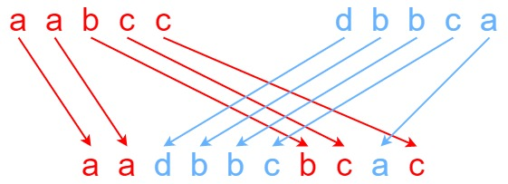

+++
title = "LeetCode - 150 - Interleaving String"
date = 2026-03-09T08:21:45+03:00
tags = ["LeetCode", "150", "Interleaving String", "2D_Dynamic_Programming", "Swift"]
draft = false
+++

### The problem

Given strings `s1`, `s2`, and `s3`, find whether `s3` is formed by an **interleaving** of `s1` and `s2`.

An **interleaving** of two strings `s` and `t` is a configuration where `s` and `t` are divided into `n` and `m` substrings respectively, such that:

* `s = s1 + s2 + ... + sn`
* `t = t1 + t2 + ... + tm`
* `|n - m| <= 1`
* The **interleaving** is `s1 + t1 + s2 + t2 + s3 + t3 + ...` or `t1 + s1 + t2 + s2 + t3 + s3 + ...`

**Note:** `a + b` is the concatenation of strings `a` and `b`.

**Example 1:**



```
Input: s1 = "aabcc", s2 = "dbbca", s3 = "aadbbcbcac"
Output: true
Explanation: One way to obtain s3 is:
Split s1 into s1 = "aa" + "bc" + "c", and s2 into s2 = "dbbc" + "a".
Interleaving the two splits, we get "aa" + "dbbc" + "bc" + "a" + "c" = "aadbbcbcac".
Since s3 can be obtained by interleaving s1 and s2, we return true.
```

**Example 2:**

```
Input: s1 = "aabcc", s2 = "dbbca", s3 = "aadbbbaccc"
Output: false
Explanation: Notice how it is impossible to interleave s2 with any other string to obtain s3.
```

**Example 3:**

```
Input: s1 = "", s2 = "", s3 = ""
Output: true
```

**Constraints:**

* `0 <= s1.length, s2.length <= 100`

* `0 <= s3.length <= 200`

* `s1`, `s2`, and `s3` consist of lowercase English letters.

**Follow up:** Could you solve it using only `O(s2.length)` additional memory space?

#### Explanation

From the description of the problem we learn that we are given **three** strings `s1`, `s2`, and `s3`, and we want to know whether we can form string `s3` by **interleaving** strings `s1` and `s2`.

> Interleaving means that we must choose characters from `s1` and `s2` that exist in `s3` while maintaining the relative order of characters.

Let's look at an example where `s3` has a third character that equals `z`:


* If we had a character in `s3` that does not exist in strings `s1` and `s2`, we would stop our algorithm and return `false` because this means that it is impossible to continue.


If we had an example where we had the same first characters in `s1` and `s2`, we would be able to choose either of them and check if one of them leads to the result.

### Brute Force (Recursion) Solution

```swift
func isInterleave(_ s1: String, _ s2: String, _ s3: String) -> Bool {
    let s1Arr = Array(s1)
    let s2Arr = Array(s2)
    let s3Arr = Array(s3)

    func dfs(_ i: Int, _ j: Int, _ k: Int) -> Bool {
        if k == s3.count {
            return (i == s1.count && (j == s2.count))
        }

        if i < s1.count && s1Arr[i] == s3Arr[k] {
            if dfs(i + 1, j, k + 1) {
                return true
            }
        }

        if j < s2.count && s2Arr[j] == s3Arr[k] {
            if dfs(i, j + 1, k + 1) {
                return true
            }
        }

        return false
    }

    return dfs(0, 0, 0)
}
```

#### Explanation


To solve this problem we are going to use three pointers `i1`, `i2`, and `i3`. Each pointer is going to represent each string `s1`, `s2`, and `s3`.


We are going to calculate the `i3` pointer by adding the pointers `s1` and `s2`.


Next, we are going to compare whether one of the characters in `s1` or `s2` at position `(0, 0)` is equal to the first character in `s3`, and you can see that it is, so we are going to increment our `i1` pointer by one.


Next, we are going to repeat the process above. You can see that we have the second `a` in `s1` that matches the second `a` in `s3`, and that we can increment the `i1` pointer.


Next, you can see that the character `b` in `s1` does not match the character `d` in `s2`. We can also see that the character `d` in `s2` matches the character `d` in `s3`, therefore we are going to increment the `i2` pointer.


Next, we are going to have the same characters `b` in `s1` and `s2`. In this case we can make two different decisions and increment one of the pointers.

We are going to continue executing this algorithm until we find a character that does not exist in `s3` or when we reach the end of the string.

This is a very inefficient solution that will take `O(2^(m+n))` time that we can optimize by using caching.

#### Time/ Space complexity

* Time complexity: `O(2^(m+n))`
* Space complexity: `O(m+n)`
* Where `m` is the length of string `s1` and `n` is the length of string `s2`

### Dynamic Programming (Top-Down) Solution

```swift
func isInterleave(_ s1: String, _ s2: String, _ s3: String) -> Bool {
    if s1.count + s2.count != s3.count {
        return false
    }

    let s1Arr = Array(s1)
    let s2Arr = Array(s2)
    let s3Arr = Array(s3)

    struct Key: Hashable {
        let i: Int
        let j: Int
    }

    var cache: [Key: Bool] = [:]

    func dfs(_ i: Int, _ j: Int, _ k: Int) -> Bool {
        if k == s3.count {
            return (i == s1.count && (j == s2.count))
        }

        if let cached = cache[Key(i: i, j: j)] {
            return cached
        }

        var res = false
        if i < s1.count && s1Arr[i] == s3Arr[k] {
            res = dfs(i + 1, j, k + 1)
        }

        if !res && j < s2.count && s2Arr[j] == s3Arr[k] {
            res = dfs(i, j + 1, k + 1)
        }

        cache[Key(i: i, j: j)] = res

        return res
    }

    return dfs(0, 0, 0)
}
```

#### Explanation

As I mentioned above, to optimize our brute-force solution we are going to use caching. We are going to store our indices and the result `true or false`, and if we find a single `true` we are going to immediately return it and stop execution of the algorithm.

The optimized solution is going to be significantly faster than the brute force solution and will take `O(m*n)` time.

#### Time/ Space complexity

* Time complexity: `O(m*n)`
* Space complexity: `O(m*n)`
* Where `m` is the length of string `s1` and `n` is the length of string `s2`

### Dynamic Programming (Bottom-Up) Solution

```swift
func isInterleave(_ s1: String, _ s2: String, _ s3: String) -> Bool {
    if s1.count + s2.count != s3.count {
        return false
    }

    let s1Arr = Array(s1)
    let s2Arr = Array(s2)
    let s3Arr = Array(s3)

    var dp = Array(repeating: Array(repeating: false, count: s2.count + 1), count: s1.count + 1)
    dp[s1.count][s2.count] = true

    for i in stride(from: s1.count, to: -1, by: -1) {
        for j in stride(from: s2.count, to: -1, by: -1) {
            if i < s1.count && s1Arr[i] == s3Arr[i + j] && dp[i + 1][j] {
                dp[i][j] = true
            }
            if j < s2.count && s2Arr[j] == s3Arr[i + j] && dp[i][j + 1] {
                dp[i][j] = true
            }
        }
    }

    return dp[0][0]
}
```

#### Explanation

We can solve this problem by using a DP bottom-up approach.

We are going to create a 2D grid where rows are going to be characters from `s1` and columns are characters from `s2`.

We are also going to need to add an additional row and column to our grid in order to find a value for the out-of-bounds case.


For example, if you look at the last character `c` in the valid row and the out-of-bounds column, you can still say that the value in that cell is valid because the last character in `s3` also has the value `c`.


If we take the last valid column with character `a` and the out-of-bounds row, the value in that cell is going to be invalid because the last character in `s3` is `c` and `a != c`.


Our base case is going to be the cell where both the row and column are out of bounds. We are going to put `true` in that cell.

For the case when we have a valid row and column we are going to validate their order and check if the resulting characters are equal to the characters in `s3`. For example, let's look at the last valid row and column.


We are trying to verify that the last characters from `s1` and `s2` (`ac`) are equal to the last two characters in `s3 = ac`, and you can see that they do.

> The order in which we concatenate characters `s1` and `s2` matters. We must start with the column first and the row second.

We are going to repeat the process above for every cell in our grid and return the result that is at position `(0, 0)`.

#### Time/ Space complexity

* Time complexity: `O(m*n)`
* Space complexity: `O(m*n)`
* Where `m` is the length of string `s1` and `n` is the length of string `s2`

#### Thank you for reading! 😊
