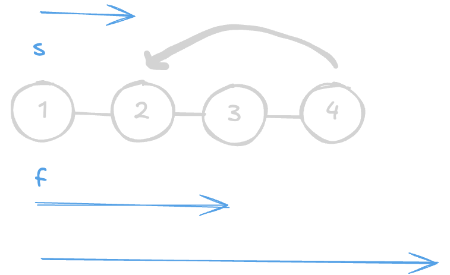

+++
title = "LeetCode - Blind 75 - Linked List Cycle"
date = 2024-12-26T11:21:15+03:00
tags = ["LeetCode", "Blind 75", "Linked List Cycle", "Swift"]
draft = false
+++

### The Problem  
Given `head`, the head of a linked list, determine if the linked list has a cycle in it.  
There is a cycle in a linked list if there is some node in the list that can be reached again by continuously following the `next` pointer. Internally, `pos` is used to denote the index of the node that the tail's `next` pointer is connected to. Note that `pos` is not passed as a parameter.  
Return `true` if there is a cycle in the linked list. Otherwise, return `false`.

#### Examples  

``` 
Input: head = [3,2,0,-4], pos = 1
Output: true
Explanation: There is a cycle in the linked list, where the tail connects to the 1st node (0-indexed).
```


```
Input: head = [1,2], pos = 0
Output: true
Explanation: There is a cycle in the linked list, where the tail connects to the 0th node.
```

```
Input: head = [1], pos = -1
Output: false
Explanation: There is no cycle in the linked list.
```

#### Constraints  
* The number of nodes in the list is in the range `[0, 10^4]`.
* `-10^5 <= Node.val <= 10^5`
* `pos` is `-1` or a valid index in the linked list.

**Follow-up**: Can you solve it using O(1) (i.e., constant) memory?

---

### Brute Force Solution  
```swift 
func hasCycle(_ head: ListNode?) -> Bool {
    var seen: Set<ListNode> = []
    var curr = head

    while curr != nil {
        if seen.contains(curr!) {
            return true
        }
        seen.insert(curr!)
        curr = curr?.next
    }

    return false
}
```

#### Explanation  
We can solve this problem in a brute-force way using additional memory with a `Set`. By iterating through all nodes in `head` and checking if `seen` contains the current node, we can determine the result.

#### Time/Space Complexity  
* **Time complexity**: O(n)  
* **Space complexity**: O(n)  

---

### Slow/Fast Pointers Solution  
```swift 
func hasCycle(_ head: ListNode?) -> Bool {
    var slow = head
    var fast = head

    while fast != nil && fast?.next != nil {
        slow = slow?.next
        fast = fast?.next?.next
        if slow === fast {
            return true
        }
    }

    return false
}
```

#### Explanation  
The slow/fast pointer technique solves the problem with constant memory space. We start from the beginning of `head` and move the `slow` pointer by one step and the `fast` pointer by two steps.  
For example, in the case of input `[1, 2, 3, 4]` with `pos = 1` (which corresponds to the value `2`), the `fast` and `slow` pointers will eventually meet at the same position with value `2`.



#### Time/Space Complexity  
* **Time complexity**: O(n)  
* **Space complexity**: O(1)  

#### Thank you for reading! 😊
