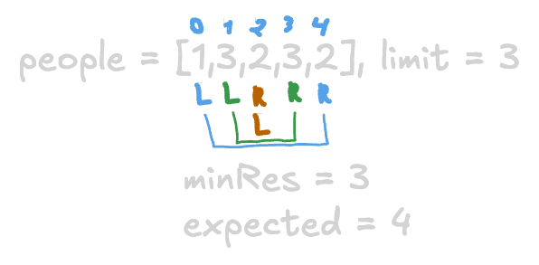
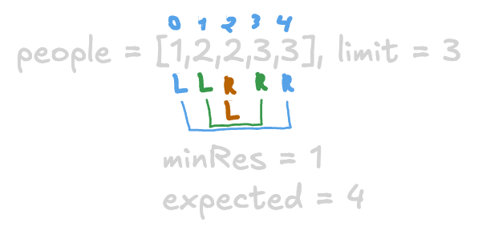

+++
title = "LeetCode - Boats to Save People"
date = 2026-09-03T11:40:49+03:00
tags = ["LeetCode", "Boats to Save People", "Two_Pointers", "Medium", "Swift"]
draft = false
+++

### The problem

You are given an array `people` where `people[i]` is the weight of the `ith` person, and an **infinite number of boats** where each boat can carry a maximum weight of `limit`. Each boat carries at most two people at the same time, provided the sum of the weight of those people is at most `limit`.

Return *the minimum number of boats to carry every given person*.

**Example 1:**

```
Input: people = [1,2], limit = 3
Output: 1
Explanation: 1 boat (1, 2)

```

**Example 2:**

```
Input: people = [3,2,2,1], limit = 3
Output: 3
Explanation: 3 boats (1, 2), (2) and (3)

```

**Example 3:**

```
Input: people = [3,5,3,4], limit = 5
Output: 4
Explanation: 4 boats (3), (3), (4), (5)

```

**Constraints:**

* `1 <= people.length <= 5 * 10^4`
* `1 <= people[i] <= limit <= 3 * 10^4`

#### Explanation

This problem was a tricky one and made me sweat 😊.

When I was thinking about brute force, I thought about every possible combination that could fit in one boat. But I was wrong because each boat can only carry two people at a time, meaning that if you put the person on the boat, you can't put him again.

I started thinking about how it can be done in one pass. With that in mind, I moved to the two-pointers technique.

### Two-Pointers Solution

#### Explanation

I thought that moving pointers would be enough. I right away recognized that it wouldn't work because the minimum result would be calculated incorrectly.


Since it did not work, I thought I needed to sort the input. This way, we will have the high weight on the right side and light weight on the left side of the array.

This move looked right, but my implementation wasn't because I was moving both pointers and ended up with a minimum of one.


At this point, I was very frustrated and confused, so I decided to ask for an AI hint **(not implementation but a hint)**. It pointed out that I should not move both pointers when the total weight of two people is higher than the limit; I just need to move the right pointer because it is possible that if I decrement the right pointer, I will find a person who would fit on the same boat.

#### Code

```swift
func numRescueBoats(_ people: [Int], _ limit: Int) -> Int {
    let n = people.count
    
    if n == 1 {
        return 1
    }
    
    var people = people
    people.sort()
    
    var res = 0
    var l = 0
    var r = n - 1
    
    while l <= r {
        if l == r {
            res += 1
            break
        }
        
        if people[l] + people[r] > limit {
            r -= 1
        } else {
            l += 1
            r -= 1
        }
        
        res += 1
    }
    
    return res
}
```

#### Time/ Space complexity

* Time complexity: O(n*logn) because of sorting
* Space complexity: O(1) or O(n) depending on sorting algorithm

#### Thank you for reading! 😊
