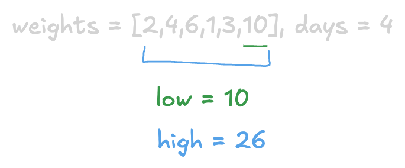
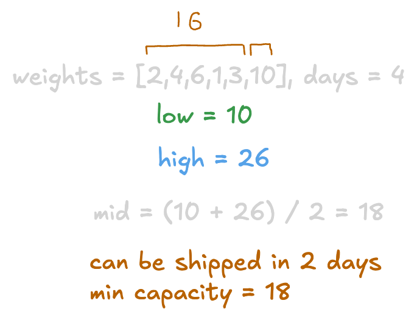
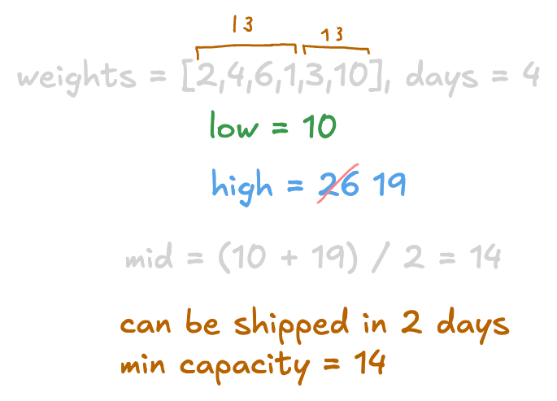
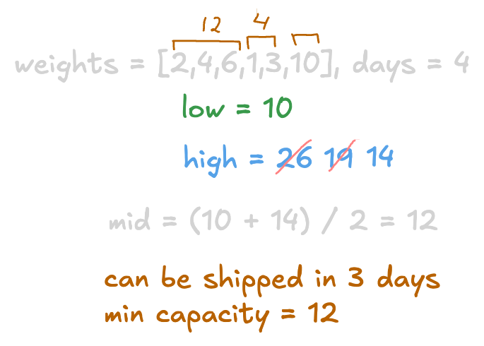
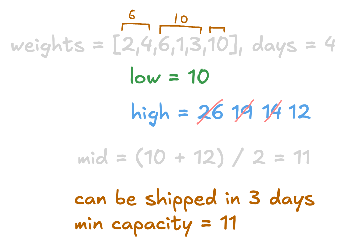
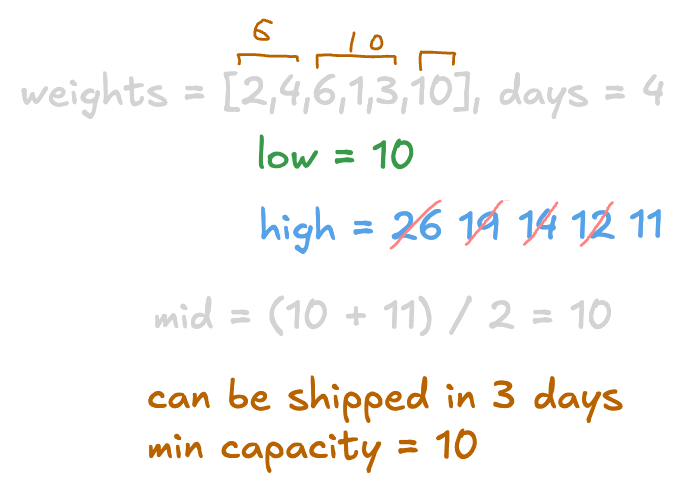

+++
title = "LeetCode - Capacity To Ship Packages Within D Days"
date = 2026-09-12T00:57:14+03:00
tags = ["LeetCode", "Capacity To Ship Packages Within D Days", "Binary_Search", "Medium", "Swift"]
draft = false
+++

### The problem

A conveyor belt has packages that must be shipped from one port to another within `days` days.

The `ith` package on the conveyor belt has a weight of `weights[i]`. Each day, we load the ship with packages on the conveyor belt (in the order given by `weights`). We may not load more weight than the maximum weight capacity of the ship.

Return the least weight capacity of the ship that will result in all the packages on the conveyor belt being shipped within `days` days.

**Example 1:**

```
Input: weights = [1,2,3,4,5,6,7,8,9,10], days = 5
Output: 15
Explanation: A ship capacity of 15 is the minimum to ship all the packages in 5 days like this:
1st day: 1, 2, 3, 4, 5
2nd day: 6, 7
3rd day: 8
4th day: 9
5th day: 10

Note that the cargo must be shipped in the order given, so using a ship of capacity 14 and splitting the packages into parts like (2, 3, 4, 5), (1, 6, 7), (8), (9), (10) is not allowed.

```

**Example 2:**

```
Input: weights = [3,2,2,4,1,4], days = 3
Output: 6
Explanation: A ship capacity of 6 is the minimum to ship all the packages in 3 days like this:
1st day: 3, 2
2nd day: 2, 4
3rd day: 1, 4

```

**Example 3:**

```
Input: weights = [1,2,3,1,1], days = 4
Output: 3
Explanation:
1st day: 1
2nd day: 2
3rd day: 3
4th day: 1, 1

```

**Constraints:**

* `1 <= days <= weights.length <= 5 * 10^4`
* `1 <= weights[i] <= 500`

#### Explanation

If you were trying to solve this problem and you could not come up with a solution in the first forty minutes, know that you are not alone. I've been trying to solve this problem for a few days (with about 1 hour each day experimenting). I don't know what it is, but something about this problem is confusing. Maybe it's just me, or the authors were trying to confuse on purpose. Nevertheless, with some deduction process and a few *hints* **(not a solution)** from AI, I finally did it.

I'm going to elaborate on the deduction part and next on hints from AI.

I knew that it was a binary search problem because the problem was inside that category. I also knew how binary search works - you need a *range* from *low* to *high* and some *target*, so I had no questions here. The *low* boundary was the maximum weight, and the *high* boundary was the *sum* of all *weights*.


The question that was bothering me - how can I split *weights* and get the capacity that can be shipped in less than or equal to `days`?

I understood that I needed somehow to count days for a given capacity, but my code kept failing tests. So I asked AI for a hint. It turned out that I was incorrectly counting days and that I needed to start counting from *1*. I was starting at *0*.

So the solution has two parts: the first part is that you are looking for the capacity; the second part tells you if that capacity is enough to ship within `days`.










The time complexity is O(n*logm), where `m` is the range from `low` to `high`. We are using `m` because we are not searching through the entire input array; we are just looking within the range that could be much smaller than the input size.

### Binary-Search Solution

#### Code

```swift
func shipWithinDays(_ weights: [Int], _ days: Int) -> Int {
    var high = weights.reduce(0, +)
    var low = weights.max()!
    
    func canShipInTime(_ capacity: Int) -> Bool {
        var daysCount = 1
        var total = 0
        
        for weight in weights {
            total += weight
            if total > capacity {
                total = weight
                daysCount += 1
                continue
            }
        }
        
        return daysCount <= days
    }
    
    while low <= high {
        let mid = (low + high) / 2
        
        if canShipInTime(mid) {
            high = mid - 1
        } else {
            low = mid + 1
        }
    }
    
    return low
}
```

#### Time/ Space complexity

* Time complexity: O(n*logm)
* Space complexity: O(1)

#### Thank you for reading! 😊
