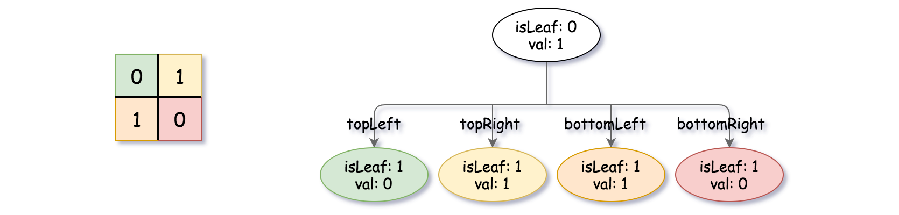
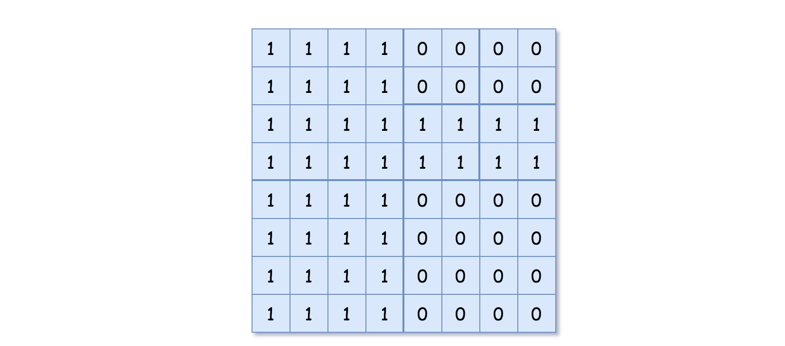
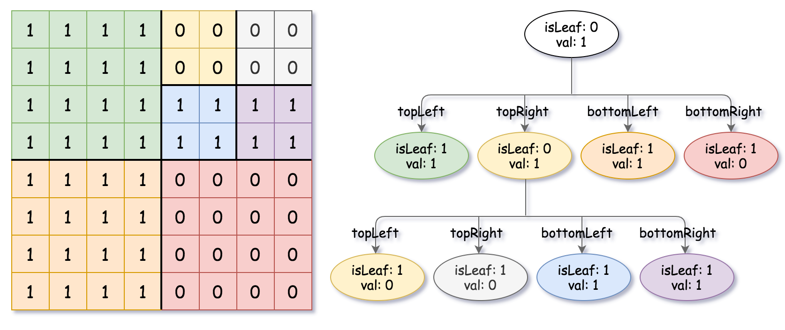

+++
title = "LeetCode - Construct Quad Tree"
date = 2026-09-26T17:51:17+03:00
tags = ["LeetCode", "Construct Quad Tree", "Trees", "Medium", "Swift"]
draft = false
+++

### The problem

Given an `n * n` matrix `grid` of `0's` and `1's` only. We want to represent `grid` with a Quad-Tree.

Return _the root of the Quad-Tree representing_ `grid`.

A Quad-Tree is a tree data structure in which each internal node has exactly four children. Besides, each node has two attributes:

- `val`: True if the node represents a grid of 1's or False if the node represents a grid of 0's. Notice that you can assign the `val` to True or False when `isLeaf` is False, and both are accepted in the answer.
- `isLeaf`: True if the node is a leaf node on the tree or False if the node has four children.

```
class Node {
   public boolean val;
   public boolean isLeaf;
   public Node topLeft;
   public Node topRight;
   public Node bottomLeft;
   public Node bottomRight;
}
```

We can construct a Quad-Tree from a two-dimensional area using the following steps:

1. If the current grid has the same value (i.e., all `1's` or all `0's`), set `isLeaf` to True, set `val` to the value of the grid, set the four children to Null, and stop.
2. If the current grid has different values, set `isLeaf` to False, set `val` to any value, and divide the current grid into four sub-grids as shown in the photo.
3. Recurse for each of the children with the proper sub-grid.


If you want to know more about the Quad-Tree, you can refer to the [wiki](https://en.wikipedia.org/wiki/Quadtree).

**Quad-Tree format:**

You don't need to read this section to solve the problem. This is only if you want to understand the output format here. The output represents the serialized format of a Quad-Tree using level order traversal, where `null` signifies a path terminator where no node exists below.

It is very similar to the serialization of the binary tree. The only difference is that the node is represented as a list `[isLeaf, val]`.

If the value of `isLeaf` or `val` is True, we represent it as **1** in the list `[isLeaf, val]`, and if the value of `isLeaf` or `val` is False, we represent it as **0**.

**Example 1:**


```
Input: grid = [[0,1],[1,0]]
Output: [[0,1],[1,0],[1,1],[1,1],[1,0]]
Explanation: The explanation of this example is shown below:
Notice that 0 represents False and 1 represents True in the photo representing the Quad-Tree.
```


**Example 2:**



```
Input: grid = [[1,1,1,1,0,0,0,0],[1,1,1,1,0,0,0,0],[1,1,1,1,1,1,1,1],[1,1,1,1,1,1,1,1],[1,1,1,1,0,0,0,0],[1,1,1,1,0,0,0,0],[1,1,1,1,0,0,0,0],[1,1,1,1,0,0,0,0]]
Output: [[0,1],[1,1],[0,1],[1,1],[1,0],null,null,null,null,[1,0],[1,0],[1,1],[1,1]]
Explanation: All values in the grid are not the same. We divide the grid into four sub-grids.
The topLeft, bottomLeft, and bottomRight each have the same value.
The topRight has different values, so we divide it into 4 sub-grids, where each has the same value.
The explanation is shown in the photo below:
```


**Constraints:**

- `n == grid.length == grid[i].length`
- `n == 2^x` where `0 <= x <= 6`

#### Explanation

I think this problem is very interesting from a practical perspective, as it is used in different areas such as image representation, image processing, efficient collision detection in two dimensions, even in GIS (Geographic Information System), and [so many other cases](https://en.wikipedia.org/wiki/Quadtree#:~:text=nodes%20as%20needed.-,Some%20common%20uses%20of%20quadtrees,edit,-A%20bitmap%20and).

From an implementation perspective, it is not so different from a usual binary tree, but it is hard to get your head around.

As they said in the description, you do not need any prior knowledge of quad trees, but you would definitely need an understanding of binary trees.

If you could not understand the problem from the start, I'm with you. I spent some time researching and mostly found academic articles (I don't have anything against them; I was just looking for a practical example), so I decided to chat with AI without asking for any hints or solutions.

The AI pointed me to the Quad-Tree construction section. After rereading it a few times, I understood that first, we can use recursion, and that means *DFS*.

Second, and I think it is the most important step, *divide the current grid into four sub-grids*. 

The question is, how can we do it?

The answer is simple: since we have a square grid and each cell is a square, we can **divide** the height and width by `2`. That gives us four equal square quadrants. In the code, it will look like this: `let half = n / 2`.


At this point, we have everything we need to construct a quad tree.

First, we must take care of the base case when `n == 1`.

After that, we are going to use the `half` property by adding it to the row and column (*where needed*), following the same principle as usual DFS on a grid when moving in different directions.

We are going to start from the top-left corner and move to the right, bottom, and diagonally.


Next, we are going to check if the values are equal to each other and assign `val` and `isLeaf` based on that check.

Lastly, we just need to call DFS with `n` as the size of `grid`.

The time complexity is `O(n*n = n^2)` because we need to visit each cell.

### Solution

#### Code
```swift
public class Node {
     public var val: Bool
     public var isLeaf: Bool
     public var topLeft: Node?
     public var topRight: Node?
     public var bottomLeft: Node?
     public var bottomRight: Node?
     public init(_ val: Bool, _ isLeaf: Bool) {
         self.val = val
         self.isLeaf = isLeaf
         self.topLeft = nil
         self.topRight = nil
         self.bottomLeft = nil
         self.bottomRight = nil
     }
}

class Solution {
   func construct(_ grid: [[Int]]) -> Node? {
       func dfs(_ n: Int, _ r: Int, _ c: Int) -> Node {
           if n == 1 {
               return Node(grid[r][c] == 1, true)
           }
           
           let half = n / 2
           
           let topLeft = dfs(half, r, c)
           let bottomLeft = dfs(half, r + half, c)
           let topRight = dfs(half, r, c + half)
           let bottomRight = dfs(half, r + half, c + half)
           
           var quadrantValuesAreEqual: Bool {
               return topLeft.val == bottomLeft.val &&
               bottomLeft.val == topRight.val &&
               topRight.val == bottomRight.val
           }
           
           var isLeaf: Bool {
               return topLeft.isLeaf &&
               bottomLeft.isLeaf &&
               topRight.isLeaf &&
               bottomRight.isLeaf
           }
           
           if quadrantValuesAreEqual && isLeaf {
               return Node(topLeft.val, true)
           } else {
               let node =  Node(
                   topLeft.val,
                   false
               )

               node.topLeft = topLeft
               node.topRight = topRight
               node.bottomLeft = bottomLeft
               node.bottomRight = bottomRight
               
               return node
           }
       }
       
       return dfs(grid.count, 0, 0)
   }
       
}
```

#### Time/ Space complexity
* Time complexity: O(n^2)
* Space complexity: O(logn) for recursion stack

#### Thank you for reading! 😊
