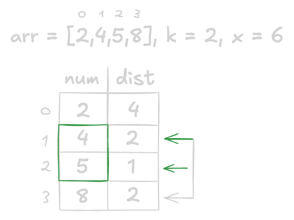
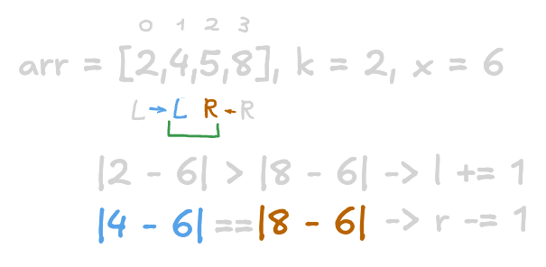

+++
title = "LeetCode - Find K Closest Elements"
date = 2026-09-07T16:04:28+03:00
tags = ["LeetCode", "Find K Closest Elements", "Sliding_Window", "Medium", "Swift"]
draft = false
+++

### The problem

Given a **sorted** integer array `arr`, two integers `k` and `x`, return the `k` closest integers to `x` in the array. The result should also be sorted in ascending order.

An integer `a` is closer to `x` than an integer `b` if:

* `|a - x| < |b - x|`, or
* `|a - x| == |b - x|` and `a < b`

**Example 1:**

**Input:** arr = \(1,2,3,4,5\), k = 4, x = 3

**Output:**\(1,2,3,4\)

**Example 2:**

**Input:** arr = \(1,1,2,3,4,5\), k = 4, x = -1

**Output:**\(1,1,2,3\)

**Constraints:**

* `1 <= k <= arr.length`
* `1 <= arr.length <= 10^4`
* `arr` is sorted in **ascending** order.
* `-10^4 <= arr[i], x <= 10^4`

#### Explanation

When I was thinking about brute force solution I firstly thought about two nested loops and every possible combination but it was the wrong move because the answer must be contiguous array since elements are in sorted order.

Next I thought that finding index where the value has the minimum distance could help.
My idea was to use that index to calculate left and right boundaries that we can use in slice. But it did not work because in some cases you can go outside boundaries and still have a correct result.

So the only valid option that I could think of was to use min heap. it worked but it was not the most efficient solution as it took O(n*logn) time, and O(n) space.
the idea behind it was to find distances for all values and put them into min heap so that you can find `k` minimum values.


```swift
struct Helper: Comparable {
    static func < (lhs: Helper, rhs: Helper) -> Bool {
        if lhs.distance == rhs.distance {
            return lhs.num < rhs.num
        } else {
            return lhs.distance < rhs.distance
        }
    }
    
    let distance: Int
    let num: Int
    let i: Int
}

func findClosestElements(_ arr: [Int], _ k: Int, _ x: Int) -> [Int] {
    var minHeap: Heap<Helper> = []
    for i in 0 ..< arr.count {
        minHeap.insert(Helper(distance: abs(arr[i] - x), num: arr[i], i: i))
    }
    
    var i = 0
    var res: [Int] = []
    while i < k {
        let helper = minHeap.removeMin()
        res.append(arr[helper.i])
        i += 1
    }
    
    res.sort()
    
    return res
}
```

### Solution

#### Explanation

I did not quite get it from the first try but it turns out that you can use sliding window technique to solve this problem.

You can put left and right pointers at start and the end of the array, iterate over until window size is equal to `k` and only update left pointer if its distance is more than the right distance and vice versa. in the end pointers will give you a range with the right answer.


You can go even further and solve it in O(logn) time by using binary search but im not going to do that. if you are curious you can try it yourself.

#### Code

```swift
func findClosestElements(_ arr: [Int], _ k: Int, _ x: Int) -> [Int] {
    let n = arr.count
    
    var l = 0
    var r = n - 1
    while r - l + 1 > k {
        if abs(arr[l] - x) > abs(arr[r] - x) {
            l += 1
        } else {
            r -= 1
        }
    }
    
    return Array(arr[l ... r])
}
```

#### Time/ Space complexity

* Time complexity: O(n)
* Space complexity: O(1)

#### Thank you for reading! 😊
