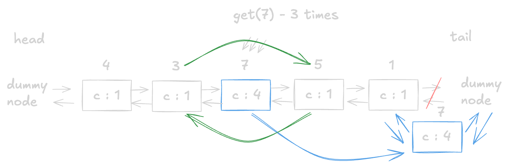
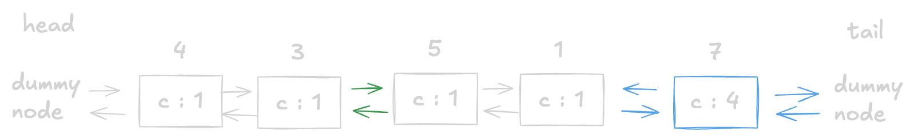

+++
title = "LeetCode - LFU Cache"
date = 2026-09-18T23:10:02+03:00
tags = ["LeetCode", "LFU Cache", "Linked_List", "Hard", "Swift"]
draft = false
+++

### The problem

Design and implement a data structure for a [Least Frequently Used (LFU)](https://en.wikipedia.org/wiki/Least_frequently_used) cache.

Implement the `LFUCache` class:

* `LFUCache(int capacity)` Initializes the object with the `capacity` of the data structure.
* `int get(int key)` Gets the value of the `key` if the `key` exists in the cache. Otherwise, returns `-1`.
* `void put(int key, int value)` Updates the value of the `key` if present, or inserts the `key` if not already present. When the cache reaches its `capacity`, it should invalidate and remove the **least frequently used** key before inserting a new item. For this problem, when there is a **tie** (i.e., two or more keys with the same frequency), the **least recently used** `key` would be invalidated.

To determine the least frequently used key, a **use counter** is maintained for each key in the cache. The key with the smallest **use counter** is the least frequently used key.

When a key is first inserted into the cache, its **use counter** is set to `1` (due to the `put` operation). The **use counter** for a key in the cache is incremented whenever either a `get` or `put` operation is called on it.

The functions `get` and `put` must each run in `O(1)` average time complexity.

**Example 1:**

```text
Input
["LFUCache", "put", "put", "get", "put", "get", "get", "put", "get", "get", "get"]
[[2], [1, 1], [2, 2], [1], [3, 3], [2], [3], [4, 4], [1], [3], [4]]
Output
[null, null, null, 1, null, -1, 3, null, -1, 3, 4]

Explanation
// cnt(x) = the use counter for key x
// cache=[] will show the last used order for tiebreakers (leftmost element is most recent)
LFUCache lfu = new LFUCache(2);
lfu.put(1, 1);   // cache=[1,_], cnt(1)=1
lfu.put(2, 2);   // cache=[2,1], cnt(2)=1, cnt(1)=1
lfu.get(1);      // return 1
                 // cache=[1,2], cnt(2)=1, cnt(1)=2
lfu.put(3, 3);   // 2 is the LFU key because cnt(2)=1 is the smallest, invalidate 2.
                 // cache=[3,1], cnt(3)=1, cnt(1)=2
lfu.get(2);      // return -1 (not found)
lfu.get(3);      // return 3
                 // cache=[3,1], cnt(3)=2, cnt(1)=2
lfu.put(4, 4);   // Both 1 and 3 have the same cnt, but 1 is LRU, invalidate 1.
                 // cache=[4,3], cnt(4)=1, cnt(3)=2
lfu.get(1);      // return -1 (not found)
lfu.get(3);      // return 3
                 // cache=[3,4], cnt(4)=1, cnt(3)=3
lfu.get(4);      // return 4
                 // cache=[4,3], cnt(4)=2, cnt(3)=3
```

**Constraints:**

* `1 <= capacity <= 10^4`
* `0 <= key <= 10^5`
* `0 <= value <= 10^9`
* At most `2 * 10^5` calls will be made to `get` and `put`.

#### Explanation

> In order to solve this problem, I would recommend solving the [LRU problem](https://leetcode.com/problems/lru-cache/description/) because the LFU solution is built on top of it. It would be very hard to code it up, especially the part with pointers. The high-level idea is not very difficult, but when it comes to implementation, you must handle a lot of corner cases.

From just reading through the problem and examples, you can see two main ideas that we should care about:

* The first one is that we must handle the `capacity`; we can't just infinitely put data. But it is the easiest part.
* The second one is where all the fun begins. We must design a data structure that will hold the *count* of how many times a key was accessed, and we also must deal with keys that have the same frequency by removing the LRU (least recently used) element.

I think we can split this problem into three parts:

* First is going to be the logic for handling capacity (*counting and removing elements when the capacity is reached*).
* Second is handling `count` for frequently accessed elements (*initiating count with `1` and updating it when the `get` method is called*) without forgetting the `put` operation.
* Third is implementing LRU logic.

My first thought was just to use a hashmap. I knew that I would hit the ceiling, but I wanted to see how far I could go and later come up with a better solution.

By using a hashmap, you might be able to pass one test or maybe even more, but you will eventually hit a wall called the tie-breaker when you try to remove elements with the same frequency.

If you have ever solved problems that had some tie-breaker in them, then you might ask why we can't use a Min Heap. And I will say that you can, and it is actually one of the ways to solve this problem. But as you know, it will take `O(n*logn)` time, which is not what we were asked for in the description.

At this point, in order to go forward, we need to understand what [LRU](https://www.enjoyalgorithms.com/blog/implement-least-recently-used-cache) is.

I won't go into details about LRU. I will just say that if you go and look at how an LRU cache is implemented, you will find that it's usually done with a Doubly Linked List and a hash map.

But I thought, why can't we just use a singly linked list? When I visualized it, I understood that in order for `get/put` operations to be efficient *(O(1) time)*, we need to know the `previous` node and connect it with the `next` one. Having only one `next` node will push us to search for the `previous` node, which could take *O(n)* time. So it is better to stick with a Doubly Linked List.

For example, if we had an input `4, 3, 7, 5, 1` and we requested the value `7` three times, we would move `7` to the head, and the previous node would be connected to the next in *O(1)* time.




The good news is that LFU uses the same data structures as an LRU does.
Now we need to figure out how it all fits together. This part was very difficult for me because, at first, I thought that we only needed one hash map. After a few trial runs, I learned that it is impossible to put all the data in one hashmap.

So, to solve this problem, we are going to need two hashmaps. In the first, we are going to store a key with a node, and in the second one, a frequency with a linked list.

We will need a few helper functions (`getOrCreateLinkedList` and `updateFrequency`) to keep the code readable.

Then everything else is managing corner cases when capacity is reached or when a node does or does not exist in the hashmap.

### Double Linked List Solution

#### Code

```swift

final class ListNode {
    
    let key: Int
    var val: Int
    var freq: Int
    var prev: ListNode?
    var next: ListNode?
    
    init(_ key: Int, _ val: Int) {
        self.key = key
        self.val = val
        self.freq = 1
        self.prev = nil
        self.next = nil
    }
    
}

final class LinkedList {
    
    private var head: ListNode
    private var tail: ListNode
    private(set) var size: Int
    
    init() {
        self.head = ListNode(-1, -1)
        self.tail = ListNode(-1, -1)
        self.head.next = self.tail
        self.tail.prev = self.head
        self.size = 0
    }
    
    func pushToTail(_ node: ListNode) {
        let prev = self.tail.prev
        prev?.next = node
        node.prev = prev
        node.next = self.tail
        self.tail.prev = node
        self.size += 1
    }
    
    func remove(_ node: ListNode?) {
        let prev = node?.prev
        let next = node?.next
        prev?.next = next
        next?.prev = prev
        node?.prev = nil
        node?.next = nil
        self.size -= 1
    }
    
    func removeFromHead() -> ListNode? {
        if self.size == 0 {
            return nil
        }
        let node = self.head.next
        self.remove(node)
        return node
    }
    
}

final class LFUCache {
    
    private let capacity: Int
    private var lfuCount: Int
    private var nodeMap: [Int: ListNode]
    private var linkedListMap: [Int: LinkedList]
    
    init(_ capacity: Int) {
        self.capacity = capacity
        self.lfuCount = 0
        self.nodeMap = [:]
        self.linkedListMap = [:]
    }
    
    func get(_ key: Int) -> Int {
        guard let node = nodeMap[key] else {
            return -1
        }
        
        updateFrequency(node)
        return node.val
    }
    
    func put(_ key: Int, _ value: Int) {
        guard capacity > 0 else {
            return
        }

        if let node = nodeMap[key] {
            node.val = value
            updateFrequency(node)
            return
        }

        if nodeMap.count == capacity {
            guard let node = linkedListMap[lfuCount]?.removeFromHead() else {
                return
            }

            nodeMap.removeValue(forKey: node.key)
        }

        let node = ListNode(key, value)

        nodeMap[key] = node
        getOrCreateLinkedList(for: 1).pushToTail(node)
        lfuCount = 1
    }
    
    func updateFrequency(_ node: ListNode) {
        let freq = node.freq
        let oldList = getOrCreateLinkedList(for: freq)

        oldList.remove(node)

        if freq == lfuCount && oldList.size == 0 {
            lfuCount += 1
        }

        node.freq += 1
        getOrCreateLinkedList(for: node.freq).pushToTail(node)
    }
    
    func getOrCreateLinkedList(for frequency: Int) -> LinkedList {
        if let list = linkedListMap[frequency] {
            return list
        }

        let list = LinkedList()
        linkedListMap[frequency] = list
        return list
    }
    
}

```

#### Time/ Space complexity

* Time complexity: O(1) for each of the `get` and `put` function calls.
* Space complexity: O(n).

#### Thank you for reading! 😊
