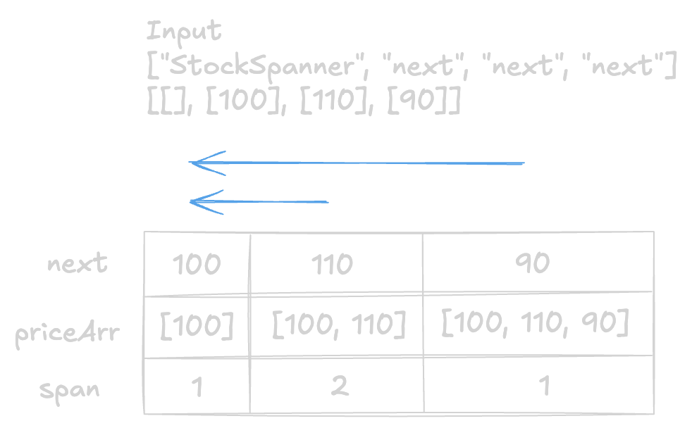
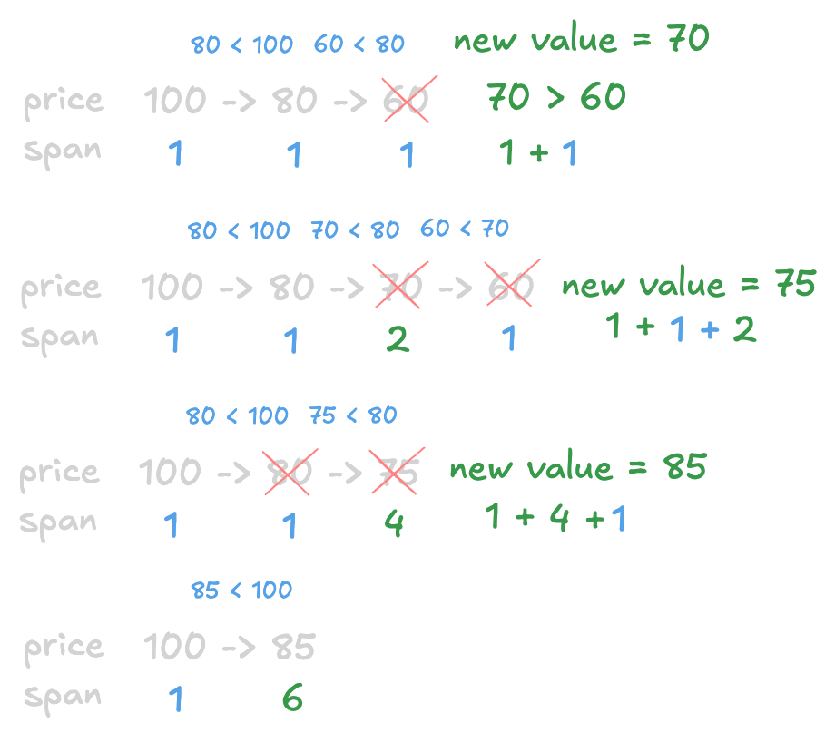

+++
title = "LeetCode - Online Stock Span"
date = 2026-09-22T21:18:26+03:00
tags = ["LeetCode", "Online Stock Span", "Stack", "Medium", "Swift"]
draft = false
+++

### The problem

Design an algorithm that collects daily price quotes for some stock and returns **the span** of that stock's price for the current day.

The **span** of the stock's price in one day is the maximum number of consecutive days (starting from that day and going backward) for which the stock price was less than or equal to the price of that day.

* For example, if the prices of the stock in the last four days are `[7,2,1,2]` and the price of the stock today is 2, then the span of today is 3 because starting from today, the price of the stock was less than or equal to 2 for 3 consecutive days.
* Also, if the prices of the stock in the last four days are `[7,34,1,2]` and the price of the stock today is `8`, then the span of today is `3` because starting from today, the price of the stock was less than or equal to `8` for `3` consecutive days.

Implement the `StockSpanner` class:

* `StockSpanner()` Initializes the object of the class.
* `int next(int price)` Returns the **span** of the stock's price given that today's price is `price`.

**Example 1:**

```
Input
["StockSpanner", "next", "next", "next", "next", "next", "next", "next"]
[[], [100], [80], [60], [70], [60], [75], [85]]
Output
[null, 1, 1, 1, 2, 1, 4, 6]

Explanation
StockSpanner stockSpanner = new StockSpanner();
stockSpanner.next(100); // return 1
stockSpanner.next(80);  // return 1
stockSpanner.next(60);  // return 1
stockSpanner.next(70);  // return 2
stockSpanner.next(60);  // return 1
stockSpanner.next(75);  // return 4, because the last 4 prices (including today's price of 75) were less than or equal to today's price.
stockSpanner.next(85);  // return 6

```

**Constraints:**

* `1 <= price <= 10^5`
* At most `10^4` calls will be made to `next`.

#### Explanation

The brute force way to solve this problem would be to have a for loop that iterates backward; this way, we can compare the current value with all of the elements that came before. The time complexity would be `O(n^2)`. The space complexity is `O(n)`.



```swift
class StockSpanner {
    
    private var priceArr: [Int]
    
    init() {
        self.priceArr = []
    }
    
    func next(_ price: Int) -> Int {
        self.priceArr.append(price)
        let n = self.priceArr.count
        var span = 0
        
        for i in stride(from: n - 1, to: -1, by: -1) {
            if self.priceArr[i] <= price {
                span += 1
            } else {
                break
            }
        }
        
        return span
    }
    
}
```

We can slightly optimize the brute force solution. Instead of comparing each value of the array, we can check the previous value first, and if it is higher than the current value, we do not need to execute the for loop and look back.

We can go even further and use a monotonic decreasing stack.
The idea behind it is simple:

* We add values until the current price is higher than the previous price.
* Then we pop everything that is less than or equal to the current price while counting the total span and adding the current price with the total span back.

In order for this to work, we are going to store `span` for each `price` so that we can easily calculate the total span.



As you can see in the picture above, it is called a monotonically decreasing stack because `price` is always going to be in decreasing order, and when the balance breaks, we are going to restore it by removing elements that are less than the new value.

This algorithm is much faster than just iterating backward and leads to `O(n)` time complexity.

### Monotonic Decreasing Stack Solution

#### Code

```swift
struct Helper {
    let price: Int
    let span: Int
}

class StockSpanner {
    
    private var priceArr: [Helper]
    
    init() {
        self.priceArr = []
    }
    
    func next(_ price: Int) -> Int {
        if self.priceArr.isEmpty {
            self.priceArr.append(Helper(price: price, span: 1))
            return 1
        } else {
            var spanRes = 1
            
            while !self.priceArr.isEmpty && price >= self.priceArr.last!.price {
                let helper = self.priceArr.removeLast()
                spanRes += helper.span
            }
            
            self.priceArr.append(Helper(price: price, span: spanRes))
            
            return spanRes
        }
    }
    
}
```

#### Time/ Space complexity

* Time complexity: O(n)
* Space complexity: O(n)

#### Thank you for reading! 😊
