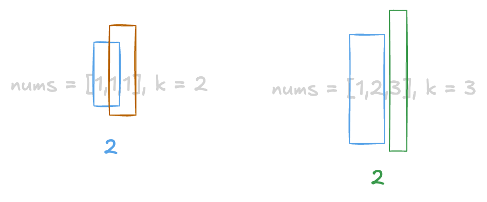

+++
title = "LeetCode - Subarray Sum Equals K"
date = 2026-08-25T20:17:45+03:00
tags = ["LeetCode", "Subarray Sum Equals K", "Arrays_&_Hashing", "Medium", "Swift"]
draft = false
+++

### The problem

Given an array of integers `nums` and an integer `k`, return *the total number of subarrays whose sum equals* `k`.

A subarray is a contiguous **non-empty** sequence of elements within an array.

**Example 1:**

```text
Input: nums = [1,1,1], k = 2
Output: 2

```

**Example 2:**

```text
Input: nums = [1,2,3], k = 3
Output: 2

```

**Constraints:**

* `1 <= nums.length <= 2 * 10^4`
* `-1000 <= nums[i] <= 1000`
* `-10^7 <= k <= 10^7`

#### Explanation

Even without visualization, you can see that each of the given examples has **two** subarrays that can sum up to `k`.



We could try to make every possible subarray and check if it sums up to `k`.
The code will look like this,
but it won't pass on LeetCode because of the memory limit.

```swift
func subarraySum(_ nums: [Int], _ k: Int) -> Int {
    var subArrays: [[Int]] = []
    
    for i in 0 ..< nums.count {
        for j in i ..< nums.count {
            subArrays.append(Array(nums[i ... j]))
        }
    }
    
    var res = 0
    for subArray in subArrays {
        let total = subArray.reduce(0, +)
        if total == k {
            res += 1
        }
    }
    
    return res
}
```

We could try to avoid additional memory where we put our subarrays,
but then we will hit the time limit because of three loops that will take O(n^3) time.

```swift
func subarraySum(_ nums: [Int], _ k: Int) -> Int {
    var res = 0
    
    for i in 0 ..< nums.count {
        for j in i ..< nums.count {
            var total = 0
            
            for num in Array(nums[i ... j]) {
                total += num
            }
            
            if total == k {
                res += 1
            }
        }
    }
    
    return res
}
```

We can slightly optimize the time by removing the unnecessary loop. The time complexity will be O(n^2) and space O(1), and it will pass on LeetCode.

```swift
func subarraySum(_ nums: [Int], _ k: Int) -> Int {
    var res = 0
    
    for i in 0 ..< nums.count {
        var total = 0
        
        for j in i ..< nums.count {
            total += nums[j]
            
            if total == k {
                res += 1
            }
        }
    }
    
    return res
}
```

We can go even further and optimize it to O(n) time.

### Hash Map Solution

#### Explanation

Maybe while you were going through the problem, you would have thought, why don't we use the sliding window technique? I thought so too, but it won't work. The problem with the sliding window is that it only works on positive numbers, but in this problem, we can have negative numbers. So instead, we can use prefix sums and a hash map to get linear time complexity that works with negative numbers.

The trick to this solution is to ask the question, "Have we seen a prefix sum before that equals `curSum - k`?" If yes, this means that somewhere earlier, we could find a chunk that sums exactly to `k`. A hash map, in this case, helps count how many times each prefix sum occurred.

#### Code

```swift
func subarraySum(_ nums: [Int], _ k: Int) -> Int {
    var res = 0
    var curSum = 0
    var prefixSums: [Int: Int] = [ 0 : 1 ]
    
    for num in nums {
        curSum += num
        let diff = curSum - k
        
        res += prefixSums[diff, default: 0]
        prefixSums[curSum] = 1 + prefixSums[curSum, default: 0]
    }
    
    return res
}
```

#### Time/ Space complexity

* Time complexity: O(n)
* Space complexity: O(n)

#### Thank you for reading! 😊
