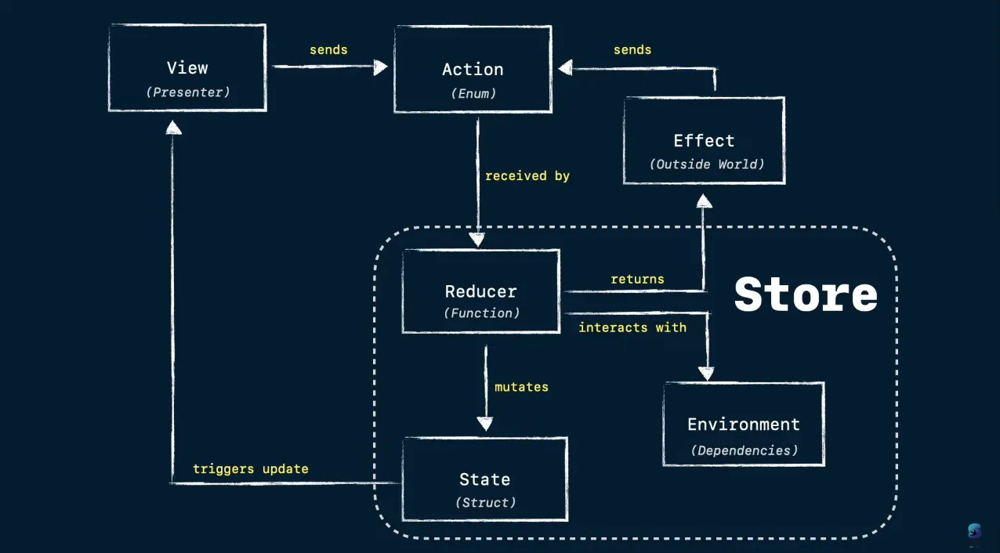

+++
title = 'Let’s talk about Composable Architecture'
date = 2023-08-11T00:00:00+03:00
tags = ["Software Architecture"]
draft = false
+++

### Introduction

The Composable Architecture (TCA) uses a unidirectional data flow (UDF).
UDF is a design pattern where data and events move consistently and predictably. In UDF, data can only be transferred to other application parts in one way.

In TCA, the only way to mutate the state is by sending actions to a runtime store. The runtime store holds the entire app’s business logic and mutates the state inside.

UDF can reduce data inconsistencies because of the single source of truth for the application.

### TCA is built around key components:
- Action
- State
- Reducer
- Effect
- Store
- Environment

### Code examples:
Timer
- https://github.com/dmytrochumakov/TCA-Examples/tree/main/Timer/Timer/Timer

### Sources:
- https://github.com/pointfreeco/swift-composable-architecture
- https://www.youtube.com/watch?v=SfFDj6qT-xg&ab_channel=SwiftandTips
- https://www.youtube.com/watch?v=XWZmgbylTpc&ab_channel=SwiftHeroes
- https://www.youtube.com/watch?v=McmGb9sexMo&ab_channel=SwiftandTips
- https://www.youtube.com/watch?v=McmGb9sexMo&ab_channel=SwiftandTips
- https://markvillar.com/the-composable-architecture/