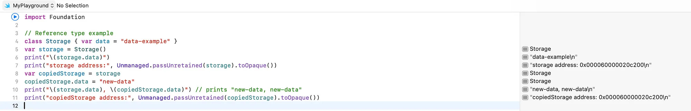

+++
title = 'What is “reference type” in Swift?'
date = 2023-12-03T00:00:00+03:00
tags = ["Swift", "Reference Type"]
draft = false
+++

### Introduction

In Swift, classes, closures, and actors all reference types.

> 'Reference type’ is instance that shares a single copy of data.

Assigning a reference type to a constant or variable, or passing it into a function or method, it is always a reference to a shared instance that is assigned or passed in.

### Example
You can pass your property value by sharing the same address in memory.

``` swift
// Reference type example
class Storage { var data = “data-example” }
var storage = Storage()
print("\(storage.data)") // prints "data-example"
print("storage address:", Unmanaged.passUnretained(storage).toOpaque())
var copiedStorage = storage      
copiedStorage.data = “new-data”      
print("\(storage.data), \(copiedStorage.data)") // prints "new-data, new-data"
print("copiedStorage address:", Unmanaged.passUnretained(copiedStorage).toOpaque())
```



As you can see, storage and copied storage property addresses are the same.

### Summary
Copying data by reference refers to the same address in memory.
This means that modifying data in one variable also affects another.
It also means that multiple reference types may refer to the same object.
